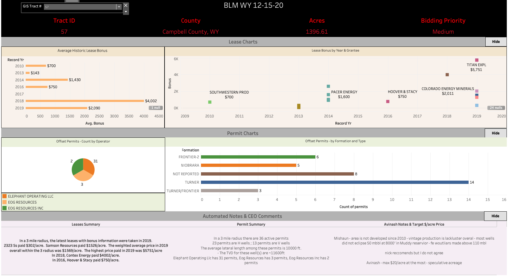
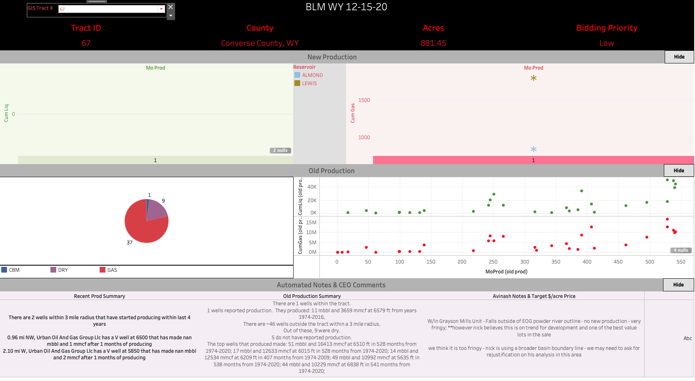
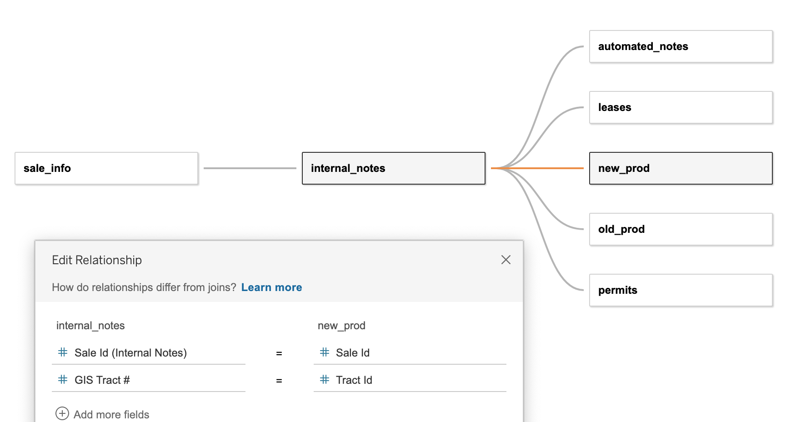

# Oil & Gas - Federal Lease Sale Evaluation Automation
Developed by Mishaun Bhakta for Magnum Producing, LP and R&R Royalty, LTD
<br><br>

# Project Summary and Goals

1.  Automate federal lease sale and auction process to dramatically increase internal efficiency and drive investment capital in high potential & returning areas.


2. Use ETL to move output data and summaries to database and report to upper management using Tableau

## Result
* **This project solved the frequent occurence of missing opportunities based on lack of time/resources to evaluate each lease across multiple sales quickly**
    * As a result, company generated $10M in profit by quicky identifying and buying prime acreage in Powder River Basin in June 2020 and participating in development wells with prolific production.

<br>

### Project Flow Diagram


### Tableau Utilization Demo


<br>

## Brief Overview of Workflow before Automation

* The company evaluates and invests in multiple federal leases up for sale in auctions each quarter.
    * Each sale could contain up to 300 leases for sale
* Manual analysis included writing summaries describing the surrounding area of the lease regarding oil and gas activity.  
    **Process could take at least 1 - 1.5 month to write notes for just 1 sale.**
    * Oil and gas activity includes: Production of existing wells, leases in the area, and permits filed for new wells
    * Data gathering involved utilizaiton within licensed web application to query data with multiple, uneconomical cursor clicks 
* Analysis would then be presented to CEO with Excel spreadsheet one by one, which would often fail due to limited time and resources to complete each sale thoroughly

### Image of Manual Process
* Draw 3 mile radius-> Manually intepret, analyze, and write summaries based on permits, production, and leases table.


<br>

# Code and Packages

1.  Code used: Python 3.7
2.  Packages used include:
    * Pandas, Geopandas
    * Selenium, Beautiful Soup, OS, pdfrw, Openpyxl
    
<br>

# App

App will accomplish goal 1 of project by reading in source data, applying geospatial filters, generating automated summaries, and exporting processed data to staging folder for ETL script to load into database.

## Script and Module Overviews

<br>

### 1. Cleaning and Data Preparation (clean_prep.py)
This module will read in source data, convert datatypes, trim unneccessary fields,  convert coordinate systems to same datum, and add fields for geospatial filtering

#### Source data read in includes:
<hr>

* Permit data (.shp) - includes specifications for new wells to be drilled by an operator
* Leasing data (.csv) - includes bonus prices for active federal leases, grantee, acreage, effective date, etc.
* New production data (.shp) - includes well and production data (total oil/gas produced) for wells drilled in last 4 years
* Old production data (.shp) - older, historical well information
* Sale shapefile (.shp) - includes geolocation and boundaries of each tract in the sale

*Permit, leasing, and production data is batch downloaded from a licensed data library and web application provided by Enverus.
Sale shapefile is found at sale auction site hosted by Energynet*

<hr>

Cleaning/Preparation process includes:
* Dropping fields that are not needed for evaluation and summary generation.
* Conversion to a uniform CRS (coordinate reference system) for all geospatial data.
* Date fields converted to datetime objects
* Add fields **buffer and centroid**, which will create geospatial points to filter source oil/gas record data within defined radius of 3 miles
* Add fields for distance and cardinal direction of source data to sale tract centroid

<br>

### 2 Wrangle and Filter Geospatial Data (wrangle_filter.py)

Functions for filtering source data based on buffer radius for each sale tract.  Main file will invoke filtering function and export output to flat files for ETL process to pickup in subsequent process.

Code Snippet of Geopandas geospatial filtering function

```python
# this will use geopandas function within to get data within buffer of test tract and then use the boolean array to filter itself to get data
permitstoeval = permitsDF.loc[permitsDF.within(saleTract["buffers"])]
    
# calculating distance (in miles) away lease within 3 mi radius is to tract of interest and direction of data point (permit, lease, prod)
leasestoeval["distance"] = leasestoeval["geometry"].apply(lambda x: x.distance(saleTract["centroids"]) / 1609.34)
leasestoeval["direction"] = leasestoeval["geometry"].apply(lambda x: cardDir(x, saleTract))

```


<br>

###  3.  Sale Note Summaries

This module will read in filtered data for each data source and write natural language summaries.  


* Functions created in this module will write summaries for each stream of data (permit, production, and leasing activity)
* Functions will use basic statistical metrics like mean, mode, std. deviation to highlight/summarize the most pertinent information
    * Pandas' functions heavily utilized to group and describe key fields


<br>
<hr>


# ETL

ETL script will pickup processed output data form main application and move data to AWS database.  
See Process Flow Diagram.

<br>

### Process Flow Diagram


<br>

### Script and Module Details

<br>

1. etl_functions.py

* Module with developed functions to handle:
    * Reading files from passed paths and parsing information
    * Retrieving sale id from parent table and appending it to dataframe/table staged for loading to database
    * Quering database with passed table and associated sale id to check if records exist to control flow of loading function 
    * Loading tables to database with functionality to handle newly inserted data with different schema than database schema

2. load_parent_table.py

* Script to load parent table with new sale name, date, and id

3. etl_config.py

* Config file contains:
    * List of sales to run ETL
    * File and table name mapping dictionary
    * Paths for data directories and database config file
    * Boolean variable to replace or not replace existing records for given table and sale 

4. build_db_connection.py

* Module with function to build pymysql or sqlalchemy database connection string from database config file

<br>

<hr>

# Sale Template Automation

Webscraper for inserting Meta Sale Data into Excel Spreadsheet and Automating Paperwork.

### Script Details

1.  This script launches sale url and extracts the following data:
* Tract serial numbers
* Acreage/Size
* Legal description
* Downloads sale shapefile and moves it into respective sale folder

2.  After scraping data, the script will insert values into created sale template Excel spreadsheeting using openpyxl package

3.  After sale is complete, the script can execute a function to scrape the sale url to find bid amount based on company's bidder number.  The winning bid quantity is then automatically inputted into the sale spreadsheet to summarize capital spent

4. Finally, paperwork required to be submitted to federal government agency are filled in using field pdf template.  Fields required to be filled in are amount paid, total amount due, serial numbers, state, and date.
* Reference article for completing this task: https://bostata.com/how-to-populate-fillable-pdfs-with-python/


<br>
<hr>

# Tableau

Tableau used for pre-sale and on the fly analysis during lease auctions for summarizing tract activity.  

Dashboards created for following use cases:
1. High level overview of sale and tracts based on permit count, highest production, competitive lease bonuses, and internal priority

2. Drill down into tract to see granular details of lease bonus, production, and permits

<br>

### Tableau Dashboard - Lease and Permit Activity


* Example of tract analysis for permitting and leasing activity around tract 57 in Federal Lease Sale on 12-15-2020.

<br>

### Tableau Dashboard - Production Activity



* Example of tract analysis for permitting and leasing activity around tract 67 in Federal Lease Sale on 12-15-2020.

<br>

### Tableau Dashboard - High Level Overview


* Example of identifying high potential tract based on permit count and bonus price. (Tract 57 in Federal Lease Sale on 12-15-2020.)

<br>

### Data Relationship

* Processed lease, production, and permit data connected to each tract by sale id and tract_id